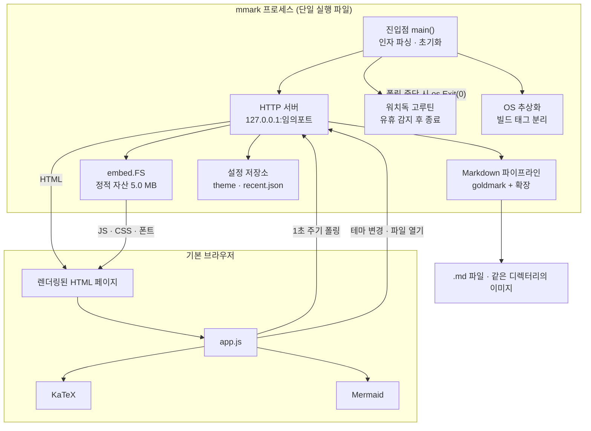
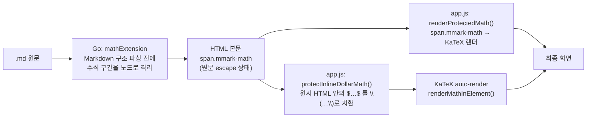
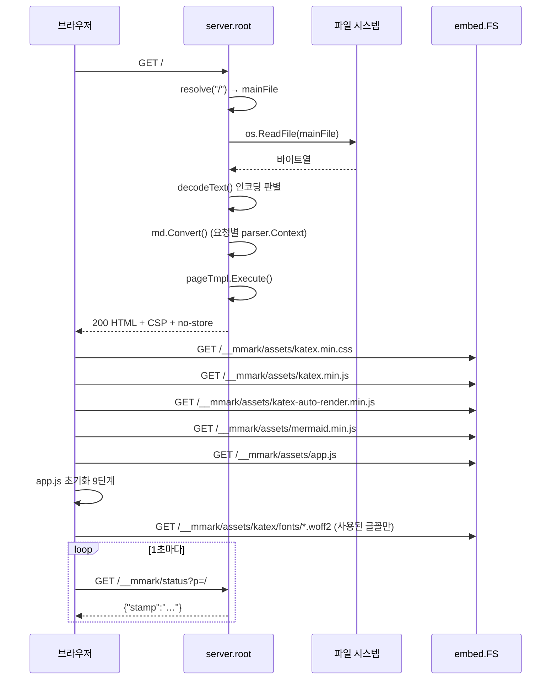

# ARCHITECTURE — mmark 설계 구조

이 문서는 mmark의 설계 의도, 컴포넌트 구성, 처리 흐름, 설계 결정의 근거를 기술한다.
파일 단위·함수 단위의 상세는 [CODE.md](CODE.md), 실행·빌드·설정은 [USAGE.md](USAGE.md)를 참조한다.

기술 내용은 모두 저장소의 실제 코드를 읽고 확인한 것이며, 동작 관련 서술은 실행·측정으로 검증했다.
검증 방법과 결과는 문서 마지막 [11. 검증](#11-검증)에 정리한다.

---

## 1. 목적과 범위

### 1.1 해결하려는 문제

Windows 환경에서 `.md` 파일을 확인하려면 통상 편집기(VS Code, Typora 등)를 설치하거나
웹 서비스에 업로드해야 한다. mmark는 다음 조건을 동시에 만족하는 뷰어를 목표로 한다.

| 조건 | 구현 방식 |
|---|---|
| 설치 절차 없음 | 단일 실행 파일(single binary), 레지스트리·설정 파일 사전 생성 없음 |
| 외부 네트워크 접근 없음 | 렌더링에 필요한 모든 자산(asset)을 바이너리에 embed |
| GitHub와 같은 결과물 | github-markdown-css + GFM(GitHub Flavored Markdown) 확장 |
| 편집기와 병행 사용 | 파일 변경 감지 후 브라우저 자동 새로고침 |
| 뷰어 UI 개발 비용 최소화 | 별도 GUI 툴킷 없이 기본 브라우저를 표시 장치로 사용 |

### 1.2 범위에 포함되는 것

- Markdown → HTML 렌더링과 브라우저 표시
- 코드 블록 문법 강조(syntax highlighting), LaTeX 수식, Mermaid 다이어그램
- 문서 목차(TOC), 본문 검색, 코드 복사, 인쇄/PDF 스타일, 테마 전환
- 문서와 같은 디렉터리에 있는 이미지·하위 `.md` 문서의 상대 경로 참조

### 1.3 범위에 포함되지 않는 것

- 편집 기능 (읽기 전용 뷰어)
- 여러 문서를 동시에 여는 탭·창 관리 (프로세스당 문서 1개, 열기는 교체 방식)
- 원격 접근 (리스너는 `127.0.0.1`에 고정)
- 문서 디렉터리 바깥 파일 접근 (경로가 기준 디렉터리로 제한됨)

### 1.4 대상 플랫폼

Windows를 1차 대상으로 설계했으나, 코드는 플랫폼 의존부를 빌드 태그(build tag)로 분리해
Linux·macOS에서도 빌드·실행된다. 플랫폼별 차이는 다음 두 가지뿐이다.

| 기능 | Windows | 그 외 |
|---|---|---|
| 파일 선택 대화상자 | `comdlg32.dll`의 `GetOpenFileNameW` 사용 | 미지원 (버튼 자체가 렌더링되지 않음) |
| 기동 오류 표시 | `user32.dll`의 `MessageBoxW` 사용 | stderr 출력만 |

---

## 2. 규모

직접 측정한 값이다(2026-08 기준 `main` 브랜치).

### 2.1 직접 작성된 코드

| 파일 | 줄 수 | 바이트 | 역할 |
|---|---:|---:|---|
| `main.go` | 755 | 24,699 | 진입점, HTTP 서버, 렌더링, 테마·최근 파일, 워치독 |
| `math.go` | 399 | 10,563 | goldmark 수식 확장 (블록·인라인 파서, 렌더러) |
| `main_test.go` | 212 | 7,057 | 단위 테스트 13개 |
| `os_windows.go` | 98 | 2,946 | Windows 전용 Win32 호출 |
| `os_other.go` | 11 | 203 | 비Windows용 no-op 스텁 |
| `assets/app.js` | 517 | 17,323 | 브라우저 측 기능 전체 |
| `assets/help.md` | 27 | 1,371 | 인자 없이 실행했을 때 표시할 도움말 |
| `.github/workflows/release.yml` | 31 | 706 | 태그 push 시 Windows 바이너리 릴리스 |
| **합계(Go)** | **1,475** | **45,468** | |
| **합계(직접 작성 전체)** | **2,050** | **64,868** | |

`main.go` 안에는 `baseCSS`라는 문자열 상수로 약 42줄(686–728행)의 CSS가 포함되어 있으며,
이는 위 `main.go` 줄 수에 포함된 값이다.

### 2.2 반입(vendored) 자산

| 파일 | 바이트 | 버전 | 바이너리 embed |
|---|---:|---|---|
| `assets/mermaid.min.js` | 3,565,102 | 11.16.0 | O |
| `assets/katex.min.js` | 271,142 | 0.17.0 | O |
| `assets/katex.min.css` | 25,146 | 0.17.0 | O |
| `assets/katex-auto-render.min.js` | 3,486 | 0.17.0 | O |
| `assets/katex/fonts/` (60개) | 1,076,572 | 0.17.0 | O |
| `assets/github-markdown-light.css` | 22,219 | 스냅샷 | O |
| `assets/github-markdown-dark.css` | 22,219 | 스냅샷 | O |
| `assets/icon.svg` | 644 | — | **X** |
| **assets/ 전체** | **5,005,224** | | |

두 github-markdown CSS는 바이트 수가 22,219로 같지만 내용은 다르다(`diff` 기준 146줄 차이,
`color-scheme`·색상 값 등). 파일 크기 일치는 우연이다.

`assets/icon.svg`는 어떤 `//go:embed` 지시자에도 포함되지 않는다. README의 상단 이미지
전용이며 실행 파일에는 들어가지 않는다. 페이지 favicon은 이 파일이 아니라
`main.go`의 HTML 템플릿에 data URI로 별도 작성된 SVG다([9.4](#94-미사용미참조-요소) 참조).

### 2.3 산출 바이너리 크기

Go 1.27.0으로 직접 빌드해 측정했다.

| 대상 | 빌드 옵션 | 크기 |
|---|---|---:|
| `windows/amd64` | `-trimpath -ldflags "-s -w -H windowsgui -X main.version=…"` | 19,709,952 바이트 (약 18.8 MiB) |
| `linux/amd64` | 옵션 없음 | 24,833,640 바이트 (약 23.7 MiB) |

크기의 대부분은 embed된 5.0 MB 자산과 chroma의 279개 lexer 정의가 차지한다.

---

## 3. 전체 아키텍처

### 3.1 구성도



### 3.2 계층 구분

| 계층 | 위치 | 책임 |
|---|---|---|
| 프로세스 제어 | `main.go` `main()`, `watchdog()`, `fatal()` | 기동, 수명 관리, 치명적 오류 처리 |
| HTTP 라우팅 | `main.go` `mux` 등록부, `server` 메서드 | 요청 → 처리기 매핑, 경로 제한 |
| 문서 변환 | `main.go` `md` 전역, `math.go` 전체 | Markdown → HTML |
| 표현(presentation) | `pageTmpl`, `baseCSS`, github-markdown CSS | HTML 골격과 스타일 |
| 클라이언트 로직 | `assets/app.js` | 폴링, 테마, 수식, 다이어그램, 목차, 검색, 복사, 인쇄 |
| 플랫폼 의존 | `os_windows.go` / `os_other.go` | 파일 선택창, 메시지 박스, 콘솔 연결 |
| 영속 상태 | `themeFile()`, `recentFile()` | 테마 선택, 최근 파일 10개 |

### 3.3 왜 로컬 HTTP 서버인가

브라우저를 표시 장치로 쓰는 방법은 두 가지다.

1. **`file://` 로 임시 HTML을 열기** — 서버가 필요 없다. 그러나 `file://`에서는
   `fetch()`가 제약되어 자동 새로고침을 구현하기 어렵고, 상대 경로 이미지의 동작이
   브라우저마다 다르며, CSP를 응답 헤더로 강제할 수 없다.
2. **loopback HTTP 서버** — 위 세 가지가 모두 해결된다. 대신 포트 점유와 프로세스 종료
   시점 문제가 새로 생긴다.

mmark는 2번을 택하고, 파생 문제를 다음과 같이 처리한다.

| 파생 문제 | 처리 |
|---|---|
| 포트 충돌 | `net.Listen("tcp", "127.0.0.1:0")`로 OS가 빈 포트를 할당 |
| 외부 노출 | 바인드 주소를 `127.0.0.1`로 고정 (`0.0.0.0` 아님) |
| 프로세스가 남는 문제 | 페이지가 1초 주기로 보내는 폴링을 heartbeat로 사용, 끊기면 자동 종료 |
| 문서 내 스크립트 실행 | 응답 헤더 CSP로 차단 |

---

## 4. 프로세스 생명주기

### 4.1 기동 순서

`main()`의 실행 순서는 다음과 같다(`main.go` 196–244행).

1. `attachConsole()` — Windows에서 `-H windowsgui`로 빌드된 바이너리의 stdout/stderr를
   부모 콘솔에 다시 연결한다. 비Windows에서는 no-op이다.
2. `--version` / `-v` 처리 후 즉시 반환.
3. `server` 구조체 생성. 이 시점에 두 테마 CSS를 **미리 조립**해 둔다
   (`buildThemeCSS`). 요청마다 재조립하지 않는다.
4. 대상 파일 결정.
   - 인자가 있으면 그 값을 사용한다.
   - 인자가 없으면 `chooseMarkdownFile()`을 호출한다(Windows에서만 실제 대화상자).
   - 그래도 없으면 도움말 모드로 진입한다(`mainFile == ""`).
5. `net.Listen("tcp", "127.0.0.1:0")`으로 리스너 생성. 실패 시 `fatal()`.
6. 6개 경로를 `http.ServeMux`에 등록.
7. `lastPoll`을 현재 시각으로 초기화하고 워치독 고루틴 기동.
8. `openBrowser()`로 기본 브라우저를 연 뒤 `http.Serve()` 진입.

브라우저를 여는 시점이 `http.Serve()` 호출 **앞**이라는 점이 중요하다. 리스너는 이미
생성되어 있으므로 커널이 연결을 큐에 쌓아 두고, `http.Serve()`가 시작되면 처리된다.
따라서 경합(race)은 발생하지 않는다.

### 4.2 종료 조건

종료 경로는 세 가지다.

| 경로 | 조건 | 코드 |
|---|---|---|
| 정상 유휴 종료 | 마지막 폴링 이후 10분 초과 상태가 2초 간격 검사에서 5회 연속 | `watchdog()` → `os.Exit(0)` |
| 기동 실패 | 인자 경로 절대화 실패, 리스너 생성 실패, `http.Serve` 반환 | `fatal()` → `os.Exit(1)` |
| `--version` | 버전 출력 후 | `main()` 반환 |

### 4.3 워치독 설계

단순히 "마지막 폴링으로부터 N분 경과 시 종료"로 구현하면 두 가지 상황에서 오작동한다.

1. **브라우저의 백그라운드 탭 스로틀링** — 숨겨진 탭의 타이머는 약 1분에 1회까지
   느려진다. 따라서 타임아웃이 짧으면 탭이 열려 있는데도 종료된다.
2. **시스템 절전(suspend)** — `lastPoll`은 벽시계 시각(wall clock)이므로, 10분 넘게
   절전했다 깨어나면 탭이 살아 있어도 즉시 유휴로 판정된다.

이에 대응해 세 겹의 완충을 둔다.

| 파라미터 | 값 | 근거 |
|---|---|---|
| `idleTimeout` | 10분 | 백그라운드 탭 스로틀링(약 1분 주기) 대비 충분한 여유 |
| `idleMisses` | 5회 연속 | 일시적 지연으로 인한 오종료 방지 |
| 검사 주기 `tick` | 2초 | 유휴 판정 후 실제 종료까지의 지연을 10초로 제한 |
| 벽시계 점프 감지 | `> 5*tick` (10초) | 절전 복귀를 감지해 `lastPoll`을 리셋하고 `misses`를 0으로 |

실제 종료 시점은 마지막 폴링 후 약 **10분 10초**다.

벽시계 점프 감지에서 `time.Time.Round(0)`을 호출하는 것은 단조 시계(monotonic clock)
성분을 제거해 순수 벽시계 차이를 얻기 위함이다. `Round(0)`을 생략하면 Go의 `Sub`가
단조 시계를 사용하므로 절전 구간이 차이에 반영되지 않아 감지가 불가능하다.

---

## 5. 컴포넌트와 책임

### 5.1 HTTP 라우팅

등록 경로는 6개다. `/__mmark/` 접두사는 내부 endpoint를 문서 파일 경로와 분리하기 위한
네임스페이스다.

| 경로 | 처리기 | 메서드 | 역할 | 상태 변경 |
|---|---|---|---|---|
| `/__mmark/assets/` | `serveAsset` | 무관 | embed된 정적 자산 서빙 | 없음 |
| `/__mmark/open` | `server.openRecent` | 무관 | 최근 파일 목록에서 문서 교체 | 있음 |
| `/__mmark/pick` | `server.pickFile` | 무관 | OS 파일 선택창 표시 후 문서 교체 | 있음 |
| `/__mmark/status` | `server.status` | 무관 | 파일 stamp 반환 + heartbeat 기록 | `lastPoll` |
| `/__mmark/theme` | `server.setTheme` | 무관 | 테마 설정·영속화 | 있음 |
| `/` | `server.root` | 무관 | 문서 렌더링 또는 정적 파일 서빙 | 없음 |

`ServeMux`의 접두사 매칭 규칙상 `/`는 catch-all이며, `/__mmark/`로 시작하는 요청만
전용 처리기로 간다. 문서 디렉터리에 `__mmark`라는 하위 디렉터리가 있으면 가려지지만,
실무상 발생 가능성이 낮아 별도 회피 코드는 없다.

### 5.2 Markdown 파이프라인

`md` 전역 변수 하나를 프로세스 전체가 공유한다(`main.go` 84–95행). goldmark의
`Markdown` 값은 설정 변경 없이 사용하는 한 동시 호출에 안전하므로, 요청마다
재생성하지 않는다. 변경 가능한 상태(heading ID 중복 추적)는 요청별
`parser.Context`에 담긴다.

활성 확장은 다음과 같다.

| 확장 | 제공 기능 |
|---|---|
| `mathExtension{}` (자체 구현) | `$…$`, `$$…$$`, `\(…\)`, `\[…\]` 수식 보호 |
| `extension.GFM` | Linkify, Table, Strikethrough, TaskList |
| `extension.Footnote` | 각주 |
| `highlighting.NewHighlighting(WithClasses(true))` | chroma 기반 코드 강조 |

파서 옵션은 `parser.WithAutoHeadingID()` 하나이며, 렌더러 옵션은 `ghtml.WithUnsafe()`
하나다. 후자는 문서에 포함된 원시 HTML을 그대로 출력한다는 뜻으로,
[8. 보안 모델](#8-보안-모델)에서 다루는 CSP가 그 대가를 상쇄한다.

#### 5.2.1 코드 강조를 클래스 방식으로 하는 이유

`chromahtml.WithClasses(true)`를 주면 chroma는 인라인 `style` 속성 대신
`<span class="k">` 같은 클래스만 출력한다. 색상 정의는 `buildThemeCSS()`가
`styles.Get("github")` / `styles.Get("github-dark")`로 각각 생성해 두 테마 CSS에
넣는다. 그 결과 **하나의 HTML 본문으로 라이트·다크 두 팔레트를 모두 표현**할 수 있고,
테마를 바꿔도 본문을 다시 렌더링할 필요가 없다. 인라인 style 방식이었다면 테마 전환마다
서버 왕복과 재렌더링이 필요했을 것이다.

생성되는 chroma CSS의 크기는 라이트 4,357바이트, 다크 5,016바이트다(`body{…}` 한 줄
포함, 실제 측정값).

#### 5.2.2 heading ID 생성기 교체

goldmark의 기본 auto heading ID는 ASCII만 남긴다. 따라서 `## 사용 방법`처럼
전부 한글인 제목은 ID가 빈 문자열이 되고, 폴백 규칙에 따라 `-`, `--1`, `--2` …로
축약된다. 이렇게 되면 `[목차](#사용-방법)` 형태의 문서 내 링크가 GitHub에서는 동작하는데
mmark에서는 깨진다.

`gitHubIDs` 타입이 이를 대체한다. 규칙은 GitHub의 slug 생성과 같다.

1. 전체를 소문자로 변환
2. 유니코드 문자(`unicode.IsLetter`)·숫자(`unicode.IsNumber`)·`_`·`-`만 유지
3. 공백은 `-`로 변환
4. 결과가 비면 `heading`
5. 중복이면 `-1`, `-2` … 접미사

한글은 `unicode.IsLetter`가 참이므로 그대로 보존된다. 실측으로 `## 두 번째 제목`이
`id="두-번째-제목"`으로 생성됨을 확인했다.

### 5.3 수식 처리 — 2단 구조

수식은 Go 측과 브라우저 측에서 각각 한 번씩 처리된다. 두 단계는 담당 범위가 다르다.



#### 5.3.1 Go 단계가 필요한 이유

Markdown 파서를 그냥 통과시키면 수식 내용이 Markdown 문법으로 오해석된다.

| 수식 원문 | 파서를 거치면 | 결과 |
|---|---|---|
| `$a*b*c$` | `*b*`가 강조로 해석 | `a<em>b</em>c` |
| `$$\n- x &= 1\n$$` | `- x`가 목록 항목으로 해석 | 블록이 분해됨 |
| `$$\n1. + y = 2\n$$` | `1.`이 순서 목록으로 해석 | 블록이 분해됨 |
| `$$…$$` 사이 빈 줄 | 문단 경계로 해석 | 블록이 둘로 쪼개짐 |

그래서 mathExtension은 **파싱 단계에서** 수식 구간을 전용 AST 노드로 잡아낸다.
디스플레이 수식은 인라인이 아니라 **블록 파서**(`mathBlockParser`)로 처리하며, 노드가
`IsRaw() == true`를 반환해 내부를 다시 Markdown으로 파싱하지 않도록 만든다. 이는
fenced code block과 같은 취급이다.

파서 우선순위 수치는 goldmark의 기본값과 대비해 이해해야 한다.

| 파서 | 우선순위 | 위치 |
|---|---:|---|
| goldmark 기본 blockquote | 800 | — |
| **`mathBlockParser`** | **850** | blockquote와 HTML block 사이 |
| goldmark 기본 HTML block | 900 | — |
| goldmark 기본 paragraph | 1000 | — |
| goldmark 기본 code span | 100 | — |
| **`mathParser` (인라인)** | **150** | code span과 link 사이 |
| goldmark 기본 link | 200 | — |
| goldmark 기본 emphasis | 500 | — |

인라인 우선순위 150의 의미가 핵심이다. code span(100)보다 **뒤**이므로
`` `$x$` ``는 코드로 남고, emphasis(500)보다 **앞**이므로 `$a*b*c$`의 `*`가 강조로
해석되기 전에 수식으로 확보된다. 이 두 성질은 각각 테스트
`TestDollarMathAvoidsCommonFalsePositives`, `TestDollarMathIsProtectedBeforeEmphasis`로
고정되어 있다.

#### 5.3.2 `$` 오탐 방지 휴리스틱

`$`는 통화 기호로도 쓰이므로 `가격은 $5 이고 $10 입니다` 같은 문장이 수식으로
오인되면 안 된다. `looksLikeInlineMathBytes()`가 다음 순서로 판정한다.

1. 공백 제거 후 빈 문자열이면 수식 아님
2. 숫자와 구분자(`.` 또는 `,`) 하나로만 이루어졌으면 수식 아님 (`5`, `3.14`, `1,000`)
3. `\ _ ^ { } = + - * / < >` 또는 `∑ ∫ √ ∞ ≈ ≠ ≤ ≥` 중 하나라도 있으면 수식
4. `x`, `a1` 같은 단일 ASCII 식별자면 수식
5. 연산자 좌우에 ASCII 영숫자가 붙어 있으면 수식 (`a = b`, `x+1`)
6. 그 외는 수식 아님

동일한 판정 로직이 `assets/app.js`의 `looksLikeInlineMath()`에 정규식으로 한 번 더
구현되어 있다. 두 구현은 의도적으로 같은 규칙을 표현하며, 적용 대상이 다르다
(Go 쪽은 Markdown 텍스트, JS 쪽은 원시 HTML 안의 텍스트 노드).

#### 5.3.3 표 안의 수식

GFM에서 표 셀 안의 `|`는 행이 쪼개지지 않도록 `\|`로 이스케이프해야 한다. 그러나 이
이스케이프는 수식 원문에 그대로 남아 KaTeX가 `\|`를 `‖`(`\Vert`)로 렌더링해 버린다.
`normalizeTableCellMath()`가 노드의 조상을 거슬러 올라가 `extast.KindTableCell`을 만나면
값의 `\|`를 `|`로 되돌린다. GitHub도 같은 처리를 한다. 표 밖에서는 되돌리지 않으므로
`$\|x\|$`(노름) 표기는 보존된다. 두 경우 모두 테스트로 고정되어 있다.

#### 5.3.4 브라우저 단계가 추가로 필요한 이유

`ghtml.WithUnsafe()` 때문에 문서 안의 원시 HTML 블록은 goldmark의 인라인 파서를 거치지
않는다. 즉 `<div>$x^2$</div>` 안의 수식은 Go 단계에서 잡히지 않는다.
`protectInlineDollarMath()`가 DOM의 텍스트 노드를 순회해 이런 잔여 `$…$`를
`\(…\)`로 바꾼 뒤 KaTeX auto-render에 넘긴다. 이때 `script`, `style`, `pre`, `code`,
`textarea`, `option` 태그와 이미 처리된 `.katex`, `.mmark-math`, `.mmark-mermaid`
요소는 건너뛴다.

### 5.4 정적 자산 서빙

자산은 두 방식으로 embed된다.

| 방식 | 대상 | 접근 |
|---|---|---|
| 문자열 embed 3개 | `github-markdown-light.css`, `github-markdown-dark.css`, `help.md` | Go 변수로 직접 참조, HTTP로 노출되지 않음 |
| `embed.FS` 1개 | `app.js`, `mermaid.min.js`, `katex.min.js`, `katex-auto-render.min.js`, `katex.min.css`, `katex/fonts/*` | `/__mmark/assets/…`로 서빙 |

이 구분에는 이유가 있다. CSS와 도움말은 서버가 렌더링 시점에 **HTML 안으로 인라인**하므로
별도 HTTP 요청이 필요 없고, 노출하면 공격면만 늘어난다. 실측으로
`/__mmark/assets/help.md`와 `/__mmark/assets/github-markdown-light.css`는 404를 반환한다.

`serveAsset`은 `path.Clean("/" + …)`로 경로를 정규화한 뒤 `assets` 접두사를 붙인다.
`/__mmark/assets/../main.go` 요청은 `path.Clean`이 `/main.go`로 만든 뒤
`assets/main.go`를 찾으므로 404가 된다(실측 확인).

응답 헤더는 `Cache-Control: public, max-age=31536000, immutable`과
`X-Content-Type-Options: nosniff`를 붙인다.

#### 5.4.1 KaTeX CSS의 폰트 경로 재작성

원본 KaTeX CSS는 폰트를 `url(fonts/KaTeX_Main-Regular.woff2)`처럼 상대 경로로 참조한다.
mmark는 CSS를 `/__mmark/assets/katex.min.css`에서 서빙하므로 상대 경로는
`/__mmark/assets/fonts/…`로 해석되는데, 실제 폰트는 한 단계 더 깊은
`/__mmark/assets/katex/fonts/…`에 있다. 이 불일치를 피하기 위해 반입된 CSS의 모든
`url()`이 **절대 경로 `/__mmark/assets/katex/fonts/…`로 재작성**되어 있다.
파일 내 `url()` 참조의 디렉터리는 전부 이 한 곳으로 확인된다.

KaTeX를 업그레이드할 때 이 재작성을 다시 적용하지 않으면 수식 글꼴이 시스템 폰트로
대체되어 조판이 무너진다. 절차는 [USAGE.md](USAGE.md)에 기술한다.

### 5.5 테마 시스템

세 가지 상태를 가진다: `auto`, `light`, `dark`.

구현은 **두 개의 `<style>` 요소와 `media` 속성 전환**이다.

```html
<style id="css-light" media="{{.LightMedia}}">…</style>
<style id="css-dark"  media="{{.DarkMedia}}">…</style>
```

| 테마 | LightMedia | DarkMedia |
|---|---|---|
| `auto` | `(prefers-color-scheme: light)` | `(prefers-color-scheme: dark)` |
| `light` | `all` | `not all` |
| `dark` | `not all` | `all` |

이 방식의 장점은 세 가지다.

1. 서버가 초기 상태를 결정해 첫 페인트부터 올바른 테마가 적용된다(테마 깜빡임 없음).
2. 클라이언트는 `style.media` 문자열만 바꾸면 되므로 전환이 즉시 이루어지고 재요청이 없다.
3. 두 CSS가 모두 문서에 있으므로 시스템 테마 변경(`auto`일 때)에도 바로 반응한다.

선택값은 `POST /__mmark/theme?set=…`로 서버에 전달되어 메모리와 OS 설정 디렉터리 양쪽에
반영된다. 영속화가 필요한 이유는 **포트가 매 실행마다 달라져 웹 origin이 바뀌므로**
`localStorage`가 유지되지 않기 때문이다.

Mermaid는 CSS로 테마를 바꿀 수 없어(SVG를 생성 시점에 스타일링) 테마 전환 시
`renderMermaidDiagrams()`가 `mermaid.initialize({theme: …})` 후 전체를 다시 그린다.
이때 `mermaidRun` 카운터로 세대를 관리해, 이전 렌더의 늦은 Promise 결과가 새 렌더를
덮어쓰지 않게 한다.

### 5.6 자동 새로고침

파일 변경 감지는 OS의 파일 감시 API(inotify, ReadDirectoryChangesW)가 아니라
**클라이언트 폴링 + 서버 stat**로 구현한다.

- 클라이언트: 1,000 ms마다 `GET /__mmark/status?p=<현재 문서의 URL 경로>`
- 서버: `os.Stat`으로 `수정시각(UnixNano)-크기` 형식의 stamp 문자열 생성
- 클라이언트: 페이지 생성 시 받은 stamp와 다르면 `location.reload()`

파일 감시 API 대신 폴링을 택한 근거는 다음과 같다.

| 항목 | 폴링 | OS 파일 감시 |
|---|---|---|
| 종료 판정 | 폴링 자체가 heartbeat이므로 추가 구조 불필요 | 별도 heartbeat 필요 |
| 플랫폼 코드 | 없음 | 플랫폼별 구현 또는 외부 의존성 |
| 네트워크 드라이브·편집기 임시 파일 | stat 결과만 보므로 영향 없음 | 이벤트 누락·중복이 잦음 |
| 비용 | 1초당 stat 1회 | 낮음 |

문서가 여러 개 열려 있어도 각 탭이 자기 경로를 보내므로 탭마다 독립적으로 판정된다.

#### 5.6.1 읽기 실패와 stamp 설계

Windows에서 편집기가 파일을 저장하는 순간에는 공유 위반(sharing violation)으로 읽기가
실패할 수 있다. 이때 stamp를 어떻게 정하느냐에 따라 동작이 갈린다.

| 상황 | stamp | 의도한 결과 |
|---|---|---|
| 파일이 실제로 없음 | `"gone"` (안정값) | 재시도 루프 없이 오류 화면 유지, 파일이 생기면 stamp가 바뀌어 자동 복구 |
| 파일은 있으나 읽기 실패 | `"retry-<증가값>"` (매번 다름) | 다음 폴링에서 반드시 불일치 → 재시도 |

오류 화면은 HTTP 404가 아니라 **200과 함께 `# 파일을 열 수 없습니다` 문서**로 반환된다.
폴링 로직을 그대로 태우기 위한 선택이다. 실측으로 존재하지 않는 `/nope.md`는 200과
stamp `"gone"`을 반환한다.

### 5.7 문서 교체 (열기)

한 프로세스는 문서를 하나만 표시한다. 문서를 바꾸는 경로는 두 가지다.

| 경로 | 검증 | 흐름 |
|---|---|---|
| `/__mmark/pick` | OS 대화상자가 실존 파일만 반환 | 대화상자 → `openFile()` → `303 See Other` → `/` |
| `/__mmark/open?p=…` | 절대 경로화 + `isMarkdown()` + `knownRecentFile()` | 검증 통과 시 `openFile()` → `303` → `/` |

`/__mmark/open`은 임의 경로를 받으면 안 되므로 **최근 파일 목록에 있는 경로만** 허용한다.
실측으로 `/__mmark/open?p=/etc/passwd`는 400을 반환한다.

`openFile()`은 `mainFile`, `baseDir`, `fs`(파일 서버)를 한 번의 락 구간에서 교체한다.
`baseDir`가 바뀌면 상대 경로 자산의 기준도 함께 바뀐다.

### 5.8 최근 파일 목록

- 저장 위치: `os.UserConfigDir()` 아래 `mmark/recent.json`
- 형식: `{"files": ["…", "…"]}`
- 최대 10개, 가장 최근에 연 파일이 맨 앞
- 읽을 때 절대 경로화·`filepath.Clean`·`isMarkdown()` 필터·중복 제거를 다시 수행
- 경로 비교는 Windows에서 대소문자 무시(`strings.EqualFold`), 그 외에서는 정확 일치

목록은 도움말 화면 하단에 `## 최근 파일` 절로 렌더링된다. 항목은 원시 HTML `<a>`로
생성하며 표시 문자열은 `template.HTMLEscapeString`으로, URL 쿼리는 `url.QueryEscape`로
각각 이스케이프한다.

### 5.9 클라이언트 (app.js)

IIFE 한 개로 감싼 ES5 문법 코드다. 트랜스파일러·번들러 없이 그대로 embed된다.
초기화 순서는 마지막 9줄에 나타난다.

| 순서 | 함수 | 순서가 중요한 이유 |
|---:|---|---|
| 1 | `setupTheme()` | 이후 Mermaid 렌더가 참조할 `resolvedTheme()`을 확정 |
| 2 | `setupOpenFile()` | — |
| 3 | `setupPrint()` | — |
| 4 | `setupMath()` | Mermaid 변환보다 앞. 이 시점의 Mermaid 소스는 아직 `<pre><code>` 안이라 수식 스캔에서 자동 제외됨 |
| 5 | `prepareMermaid()` | `<pre>`를 `div.mmark-mermaid`로 교체 |
| 6 | `setupCodeCopy()` | Mermaid 교체 후에 실행되어야 다이어그램에 복사 버튼이 붙지 않음 |
| 7 | `setupToc()` | 최종 DOM 기준으로 heading 수집 |
| 8 | `setupSearch()` | — |
| 9 | `setupPolling()` | 초기화 완료 후 폴링 시작 |

---

## 6. 데이터 흐름

### 6.1 최초 페이지 로드



### 6.2 인코딩 판별 (`decodeText`)

Windows에서 생성된 텍스트 파일은 UTF-8이 아닌 경우가 흔하다. 판별 순서는 다음과 같다.

| 순서 | 조건 | 처리 |
|---:|---|---|
| 1 | 앞 2바이트가 `FF FE` | UTF-16 LE (BOM 포함) 디코드 |
| 2 | 앞 2바이트가 `FE FF` | UTF-16 BE (BOM 포함) 디코드 |
| 3 | 앞 3바이트가 `EF BB BF` | UTF-8 BOM 제거 |
| 4 | 나머지가 유효한 UTF-8 | 그대로 사용 |
| 5 | 그 외 | EUC-KR/CP949로 디코드 |
| 6 | 5도 실패 | 원본 바이트를 그대로 문자열화 |

UTF-16은 BOM이 있을 때만 처리한다. BOM 없는 UTF-16은 지원하지 않는다.
1·2번은 구형 메모장의 "유니코드" 저장과 PowerShell 5.1의 리다이렉션 출력에서,
5번은 CP949로 저장된 기존 문서에서 각각 필요하다.

### 6.3 정적 파일 서빙 흐름

문서 디렉터리 안의 이미지·CSS 등은 `http.FileServer(http.Dir(baseDir))`가 처리한다.
분기는 `server.root`에서 이루어진다.

```
GET <경로>
  ├─ mainFile 없음 (도움말 모드)
  │    ├─ 경로가 "/"        → 도움말 렌더링 (stamp="help")
  │    └─ 그 외             → 404
  └─ mainFile 있음
       ├─ resolve() 실패     → 404
       ├─ 경로가 "/" 또는 .md 확장자 → renderFile() (Markdown 렌더링)
       └─ 그 외             → http.FileServer가 서빙
```

`resolve()`는 URL 경로를 `path.Clean`으로 정규화한 뒤 `baseDir`에 결합하고,
결과가 `baseDir` 또는 `baseDir + 구분자` 접두사를 가지는지 확인한다.
드라이브 루트(`E:\`)나 UNC 공유 루트처럼 `baseDir`가 이미 구분자로 끝나는 경우를
고려해 접두사를 조립할 때 중복 구분자를 붙이지 않는다.

---

## 7. 상태와 동시성

### 7.1 공유 상태 목록

| 상태 | 타입 | 보호 | 쓰기 시점 |
|---|---|---|---|
| `lastPoll` | `atomic.Int64` | atomic | `status` 처리기, 워치독의 벽시계 점프 감지 |
| `errSeq` | `atomic.Int64` | atomic | 읽기 실패 시 stamp 생성 |
| `scriptNonce` | `string` | 불변 | 프로세스 기동 시 1회 (`crypto/rand` 16바이트 → hex 32자) |
| `server.mainFile`, `.baseDir`, `.fs` | `string`, `http.Handler` | `server.mu` (RWMutex) | `openFile()` |
| `server.theme` | `string` | `server.mu` | `setTheme()` |
| `server.baseCSS/.lightCSS/.darkCSS` | `template.CSS` | 사실상 불변 | 기동 시 1회 |
| 최근 파일 파일 I/O | — | `recentMu` (Mutex) | `rememberRecentFile()` |
| goldmark heading ID 집합 | `gitHubIDs` | 요청별 인스턴스 | 요청마다 새로 생성 |

`server.mu`의 주석은 "위쪽 가변 필드와 theme을 보호한다"고 쓰여 있으나, 실제로 보호되는
것은 `baseDir`, `mainFile`, `fs`, `theme` 네 개다. `baseCSS`·`lightCSS`·`darkCSS`는
기동 시 한 번 쓰고 이후 읽기만 하므로 락 없이 접근해도 문제가 없다. 주석 표현이 실제
범위보다 넓다.

### 7.2 nonce가 프로세스 단위인 이유

CSP의 `script-src 'nonce-…'`에 쓰이는 값은 프로세스 기동 시 한 번 생성되어 모든 페이지가
공유한다. 요청마다 새로 만들면 보안이 조금 더 엄격해지지만, 얻는 것이 없다. nonce의
목적은 "문서에 포함된 스크립트"와 "mmark가 삽입한 스크립트"를 구분하는 것인데,
문서 작성자는 어차피 실행 중인 프로세스의 nonce를 알 수 없기 때문이다.

---

## 8. 보안 모델

### 8.1 위협 모델

가정하는 위협은 **출처가 불분명한 `.md` 파일을 여는 것**이다. 이 파일에는
`<script>`, `onerror=`, 외부 리소스 참조, 상위 디렉터리를 겨냥한 링크가 들어 있을 수 있다.
로컬 사용자 자신은 위협으로 보지 않는다.

### 8.2 방어 계층

| 계층 | 구현 | 막는 것 |
|---|---|---|
| 네트워크 | `127.0.0.1`에만 바인드, 포트는 OS 할당 난수 | 외부 호스트에서의 접근 |
| 경로 | `resolve()`가 `baseDir` 밖 경로를 거부 | 문서 디렉터리 바깥 파일 노출 |
| 자산 경로 | `serveAsset`의 `path.Clean` 후 `assets/` 접두사 | embed FS 바깥 접근 |
| 입력 검증 | `validTheme()`, `isMarkdown()`, `knownRecentFile()` | 임의 값·임의 파일 지정 |
| 콘텐츠 | 응답 CSP 헤더 | 문서 내 스크립트 실행, 외부 리소스 로드 |
| MIME | `X-Content-Type-Options: nosniff` | 콘텐츠 타입 추측 기반 공격 |

### 8.3 CSP 정책

```
default-src 'none';
img-src 'self' data: blob:;
media-src 'self' data: blob:;
font-src 'self' data:;
style-src 'self' 'unsafe-inline';
script-src 'nonce-<32자 hex>';
connect-src 'self';
base-uri 'none';
form-action 'none'
```

각 지시자의 근거는 다음과 같다.

| 지시자 | 값 | 근거 |
|---|---|---|
| `default-src` | `'none'` | 명시하지 않은 모든 것을 차단하는 기본값 |
| `img-src` | `'self' data: blob:` | 문서와 같은 디렉터리의 이미지, data URI, Mermaid가 만드는 blob 허용. 외부 호스트는 불허(원격 이미지를 통한 열람 추적 차단) |
| `style-src` | `'self' 'unsafe-inline'` | 테마 CSS가 인라인 `<style>`이고, Mermaid가 SVG 안에 `<style>`을 넣기 때문에 필요 |
| `script-src` | nonce만 | 문서 내 인라인 스크립트와 이벤트 핸들러 속성을 모두 차단. `'unsafe-inline'`·`'strict-dynamic'` 없음 |
| `connect-src` | `'self'` | 폴링·테마 설정용. 외부 전송 차단 |
| `base-uri`, `form-action` | `'none'` | `<base>` 조작과 폼 전송을 통한 유출 차단 |

브라우저 실측 결과, 문서에 넣은 `<script>window.__PWNED__=true</script>`와
``가 모두 다음 콘솔 메시지와 함께 차단되었고 전역 변수는 설정되지 않았다.

```
Executing inline script violates the following Content Security Policy directive 'script-src 'nonce-…
Executing inline event handler violates the following Content Security Policy directive 'script-src 'nonce-…
```

같은 페이지의 상대 경로 이미지(`pic.svg`)는 정상 로드되었다.

### 8.4 남아 있는 노출면

정확한 기술을 위해 방어하지 않는 부분도 적어 둔다.

| 항목 | 내용 |
|---|---|
| 같은 기기의 다른 프로세스 | loopback 포트에 접근할 수 있으면 문서 디렉터리의 파일을 읽을 수 있다. 포트가 난수라는 점에만 의존한다. |
| 메서드 제한 없음 | `/__mmark/theme`, `/__mmark/pick`, `/__mmark/open`은 HTTP 메서드를 검사하지 않는다. `/__mmark/open`은 GET으로 서버 상태를 바꾼다. |
| CSRF 토큰 없음 | 위 endpoint에 CSRF 방어가 없다. 공격자가 난수 포트를 알아내야 하므로 실질 위험은 낮다. |
| `WithUnsafe()` | 원시 HTML이 그대로 출력된다. 스크립트 실행은 CSP가 막지만 레이아웃 조작·시각적 위장은 가능하다. |

---

## 9. 설계 결정 정리

### 9.1 주요 결정과 근거

| # | 결정 | 근거 | 대가 |
|---:|---|---|---|
| 1 | 브라우저를 렌더러로 사용 | GUI 툴킷·웹뷰 의존성 없이 완전한 CSS·SVG·폰트 지원 확보 | 브라우저 기동 시간, 로컬 서버 필요 |
| 2 | 모든 자산 embed | 완전 오프라인, 배포물 1개 | 바이너리 약 18.8 MiB |
| 3 | 폴링 기반 변경 감지 | 파일 감시 API 대비 플랫폼 코드가 없고, 폴링이 곧 heartbeat | 1초 지연, 초당 stat 1회 |
| 4 | 폴링 단절 시 자동 종료 | 사용자가 프로세스를 직접 끝낼 필요 없음 | 오종료 방지를 위한 3중 완충 필요 |
| 5 | chroma를 클래스 모드로 사용 | 본문 재렌더링 없이 테마 전환 | 두 테마의 chroma CSS를 모두 전송(합계 약 9.4 KB) |
| 6 | 두 stylesheet의 `media` 전환 | 첫 페인트부터 정확, 전환 시 재요청 없음 | HTML에 CSS 두 벌 포함(합계 약 55 KB) |
| 7 | 테마·최근 파일을 OS 설정 디렉터리에 저장 | 포트(=origin)가 매번 달라 `localStorage`가 유지되지 않음 | 파일 I/O, 설정 디렉터리 생성 |
| 8 | 수식을 파서 단계에서 격리 | Markdown 문법과 LaTeX 문법의 충돌을 근본적으로 회피 | 자체 확장 399줄 |
| 9 | 디스플레이 수식을 블록 파서로 | 빈 줄·`-`·`1.`이 들어간 `aligned` 환경을 보존 | 단일 행 `$$…$$`는 인라인 파서로 넘기는 분기 필요 |
| 10 | heading ID 생성기 교체 | 한글 제목 앵커를 GitHub와 일치시킴 | goldmark 내부 인터페이스 의존 |
| 11 | CSP + `WithUnsafe()` 조합 | 원시 HTML(정렬·`<details>` 등)은 살리고 스크립트만 차단 | CSP 지시자 설계 필요 |
| 12 | 오류 페이지를 HTTP 200으로 | 폴링 로직 하나로 오류 상태까지 자동 복구 | 링크 검사 도구에는 깨진 링크가 200으로 보임 |
| 13 | 플랫폼 의존부를 빌드 태그로 분리 | Windows 전용 API를 쓰면서도 다른 OS에서 빌드·테스트 가능 | 인터페이스 4개를 양쪽에 유지 |

### 9.2 확인된 결함 (아키텍처 수준)

실행·측정으로 확인한 결함이다. 코드 수준 상세와 수정 방향은 [CODE.md](CODE.md)에 있다.

#### 결함 A — Windows 파일 선택 대화상자가 panic한다

`os_windows.go`의 `chooseMarkdownFile()`이 파일 필터 문자열을
`syscall.StringToUTF16`에 넘긴다. 이 함수는 인자에 NUL 바이트가 있으면 값을 반환하지 않고
**panic**한다(Go 표준 라이브러리의 명시된 동작). 그런데 Win32 `OPENFILENAMEW`의
`lpstrFilter`는 정의상 NUL로 구분되고 이중 NUL로 끝나는 문자열이어야 하므로, 해당
필터 문자열에는 NUL이 4개 들어 있다(실측).

영향 범위는 두 가지다.

| 진입 경로 | 결과 |
|---|---|
| 인자 없이 `mmark.exe` 실행 | `main()`에서 panic → 리스너 생성 전에 프로세스 종료. 문서화된 "파일 선택창 → 도움말" 흐름에 도달하지 못한다. |
| 페이지의 📂 버튼 | `/__mmark/pick` 처리기에서 panic. `net/http`가 panic을 복구하고 연결만 끊으므로 서버는 살아 있고 버튼만 동작하지 않는다. |

인자로 파일을 지정하는 경로(드래그 앤 드롭, 파일 연결, 명령줄)는 이 함수를 호출하지
않으므로 영향이 없다. 이것이 결함이 눈에 띄지 않은 이유로 보인다.

이 결함은 Windows 전용이며, 비Windows 빌드의 `chooseMarkdownFile()`은 즉시
`("", false)`를 반환하는 스텁이므로 해당되지 않는다.

#### 결함 B — 본문이 가운데 정렬되지 않고 목차가 본문을 덮는다

`baseCSS`는 `.markdown-body`에 `margin:0 auto`를 지정해 본문을 가운데 정렬하려 한다.
그런데 뒤이어 삽입되는 github-markdown CSS의 2행에도 같은 선택자 `.markdown-body`가 있고
그 안에 `margin: 0`이 있다. 선택자 특이도(specificity)가 같으므로 **나중에 오는 규칙이
이긴다.** 결과적으로 계산된 `margin-left`/`margin-right`는 항상 `0px`다.

Chrome에서 실측한 값이다.

| 뷰포트 폭 | `.markdown-body` 계산 margin | article 좌표 | 첫 문단 좌표 | `#toc` 좌표 |
|---:|---|---|---|---|
| 1300 px | `0px / 0px` | left 0, width 980 | 45 → 935 | 16 → 252 |
| 1400 px | `0px / 0px` | left 0, width 980 | 45 → 935 | 16 → 252 |
| 1600 px | `0px / 0px` | left 0, width 980 | 45 → 935 | 16 → 252 |

`#toc`는 `position:fixed; left:16px; width:236px`이고 폭 1261 px 이상에서 기본으로
표시되므로, 오른쪽 끝이 252 px다. 본문 텍스트는 45 px에서 시작한다. 따라서 목차 패널이
본문 텍스트의 앞부분 약 207 px를 항상 가린다.

두 가지 독립적인 방법으로 확인했다.

- `document.elementFromPoint()`를 `<h1>` 텍스트 시작 지점에 대해 호출한 결과가 `toc`
- 본문 링크를 클릭하려 하면 자동화 도구가
  `<nav id="toc"> intercepts pointer events`로 거부

가운데 정렬이 의도대로 동작하더라도 문제가 완전히 사라지지는 않는다. 본문 텍스트의
왼쪽 좌표는 `(W-980)/2 + 45`이므로 252 px를 넘으려면 `W ≥ 1394`가 필요하다. 즉
breakpoint 1261 px와 실제 여유가 생기는 1394 px 사이 구간에서는 원래 설계대로여도
겹친다.

#### 결함 C — 자산 캐시 헤더가 실행 간에 효과가 없다

`serveAsset`은 `Cache-Control: public, max-age=31536000, immutable`을 붙인다. 그러나
HTTP 캐시의 키에는 origin(스킴+호스트+**포트**)이 포함되고, mmark는 매 실행마다 다른
난수 포트를 사용한다. 따라서 3.5 MB의 Mermaid 번들과 271 KB의 KaTeX 번들이 **실행할
때마다 다시 전송된다.** loopback 전송이라 체감 지연은 작지만, 이 헤더가 실행 간에는
아무 이득을 주지 않는다는 점은 사실이다. 같은 실행 안에서 문서를 이동할 때는 캐시가
동작한다.

### 9.3 설계상의 한계 (결함이 아닌 것)

| 항목 | 내용 |
|---|---|
| 상위 디렉터리 문서 링크 | 브라우저가 `../`를 URL 단계에서 정규화하므로 `[x](../other.md)`는 `/other.md`로 전송되고, 결국 `baseDir/other.md`를 찾는다. 문서 디렉터리 밖 문서로는 이동할 수 없다. 경로 제한 설계의 직접적 귀결이다. |
| 문서 1개 제한 | 문서를 열면 기존 문서를 대체한다. 여러 문서를 동시에 보려면 프로세스를 여러 개 띄운다. |
| 도움말 모드의 stamp 고정 | 도움말 화면의 stamp는 항상 `"help"`이므로 다른 탭에서 문서를 열어도 도움말 탭은 갱신되지 않는다. |
| 폰트의 Content-Type | Go의 내장 MIME 표에는 `.woff2`/`.woff`/`.ttf`가 없다. Windows에서는 레지스트리에 등록되어 있지 않으면 Content-Type 헤더 없이 전송된다. 브라우저는 폰트 요청에 `nosniff` 차단을 적용하지 않으므로 렌더링에는 영향이 없다. |
| `resolve("")` | 빈 문자열을 넘기면 `baseDir` 자체를 반환한다. `/__mmark/status?p=`는 디렉터리를 stat한다. app.js는 항상 경로를 보내므로 실제로는 도달하지 않는다. |
| `-h`/`--help` 없음 | `--version`·`-v`가 아닌 첫 인자는 모두 파일 경로로 취급된다. |

### 9.4 미사용·미참조 요소

| 항목 | 상태 |
|---|---|
| `assets/icon.svg` | 어떤 `//go:embed`에도 포함되지 않는다. README 이미지 전용이다. 페이지 favicon은 `pageTmpl` 안에 data URI로 따로 작성된 100×100 viewBox SVG이며, `icon.svg`는 512×512다. 두 그림은 같은 도안이지만 별개 사본이므로 한쪽만 고치면 어긋난다. |
| `.gitignore`의 `dist/` | 저장소에도 릴리스 워크플로에도 `dist/`를 만드는 곳이 없다. 워크플로는 저장소 루트에 `mmark.exe`를 만든다. |
| `app.js`의 `data-mmark-theme` | `applyTheme()`이 `document.documentElement.dataset.mmarkTheme`을 설정하지만, 저장소 전체에서 이 속성을 읽는 CSS·JS가 없다. 디버깅·자동화 테스트에는 유용하다. |
| `parseBackslashMath()`의 첫 스캔 | `display == true`인 경로에서 `findBackslashClose()`의 결과가 즉시 버려진다. 결과에 영향은 없고 스캔 1회가 낭비된다. |

### 9.5 README·부속 문서의 실제와 다른 점

| 위치 | 내용 |
|---|---|
| README 기능 목록 | KaTeX 수식 렌더링 항목이 두 번(29행, 39행) 나온다. 내용이 겹친다. |
| README·`help.md` | `--version`/`-v`, 키보드 단축키(`Ctrl`/`Cmd`+`F`, `/`, `Esc`, `Enter`, `Shift`+`Enter`), 최근 파일 저장 파일명·개수 제한을 다루지 않는다. |
| README 35행 | "파일을 지정하지 않고 실행하면 Windows 파일 선택창 표시"라고 되어 있으나, 결함 A로 인해 현재 Windows에서는 이 경로가 panic한다. |
| `THIRD_PARTY_NOTICES.md` | "embeds the following runtime assets"라는 범위 선언대로 웹 자산 3종만 다룬다. 실행 파일에 정적 링크되는 goldmark(MIT), goldmark-highlighting(MIT), chroma(MIT), regexp2(MIT), `golang.org/x/text`(BSD-3-Clause)는 목록에 없다. README 본문은 chroma를 언급한다. |

---

## 10. 확장 지점

새 기능을 넣을 때 손대야 할 위치를 정리한다.

| 추가하려는 것 | 손댈 위치 |
|---|---|
| 새 Markdown 확장 | `main.go`의 `md` 선언에 `goldmark.WithExtensions(...)` 항목 추가 |
| 새 코드 강조 테마 | `buildThemeCSS()` 호출부의 chroma 스타일 이름 |
| 새 UI 버튼 | `pageTmpl`의 `#controls`에 `<button>` 추가 → `baseCSS`에 스타일 → `app.js`에 `setupXxx()` 작성 후 초기화 목록에 등록 |
| 새 서버 endpoint | `main()`의 `mux.HandleFunc` 등록 + `server` 메서드. `/__mmark/` 접두사를 유지할 것 |
| 새 파일 확장자 | `isMarkdown()`과 `os_windows.go`의 대화상자 필터 문자열 양쪽 |
| 새 텍스트 인코딩 | `decodeText()`의 판별 순서 |
| 새 플랫폼 기능 | `os_windows.go`/`os_other.go` 양쪽에 같은 시그니처의 함수 추가 |

---

## 11. 검증

이 문서의 사실 관계는 다음 방법으로 확인했다.

### 11.1 정적 확인

- 저장소의 모든 텍스트 파일(직접 작성 코드 2,050줄)을 통독
- `//go:embed` 지시자와 `assets/` 실제 파일 목록 대조
- 반입 자산의 버전 문자열 확인: Mermaid `version:"11.16.0"`, KaTeX `"0.17.0"`
- KaTeX CSS의 `url()` 참조 디렉터리가 `/__mmark/assets/katex/fonts` 한 곳뿐임을 확인
- chroma 2.27.0의 embed된 lexer 279개 중 `mermaid` 이름이 없음을 확인
  (따라서 goldmark-highlighting이 `<pre><code class="language-mermaid">` 폴백을 출력하고,
  `app.js`의 선택자가 이를 잡는다)
- goldmark 1.8.2의 기본 파서 우선순위 값을 원본에서 확인

### 11.2 빌드·테스트

Go 1.27.0 기준.

| 항목 | 결과 |
|---|---|
| `go build ./...` | 성공 |
| `go vet ./...` (linux/amd64) | 지적 사항 없음 |
| `go vet ./...` (windows/amd64) | 지적 사항 없음 |
| `go test ./...` | 13개 전부 통과 (`ok github.com/33modeling/mmark 0.038s`) |
| Windows 크로스 빌드 | 성공, 19,709,952 바이트 |

### 11.3 실행 확인

실제 바이너리를 기동하고 headless Chrome으로 페이지를 열어 측정했다.

| 확인 항목 | 결과 |
|---|---|
| 리스너 주소 | `127.0.0.1:<난수 포트>` |
| 응답 헤더 | `Cache-Control: no-store`, `X-Content-Type-Options: nosniff`, CSP 9개 지시자 전부 |
| KaTeX | 인라인·디스플레이·표 안 수식 3개 모두 렌더링, 오류 0 |
| 표 안의 `$P(a\|b)$` | `P(a∣b)`로 정규화되어 렌더링, 셀 구조 유지 |
| Mermaid | `graph TD` 블록이 SVG 1개로 렌더링, 오류 0 |
| 코드 강조 | `pre.chroma` 1개 생성 |
| 복사 버튼 | 코드 블록에만 1개 (Mermaid 블록에는 붙지 않음) |
| 목차 | 링크 3개 생성, `h2` id가 `두-번째-제목` |
| 각주 | `.footnotes` 생성 |
| KaTeX 폰트 | 사용된 2개 패밀리 `loaded` 상태 |
| 콘솔 오류·실패 요청 | 없음 |
| 자동 새로고침 | 파일에 제목을 추가하자 약 2.5초 내 재로드(목차 링크 3 → 4) |
| 검색 | `제목` 입력 시 하이라이트 3개, 카운터 `1/3` |
| 테마 전환 | 1회 클릭으로 `auto` → `light`, 버튼 글리프 🌗 → ☀️, 설정 파일에 `light` 기록 |
| CSP | 문서 내 `<script>`와 `onerror` 모두 차단, 전역 변수 미설정 |
| 상대 경로 이미지 | 정상 로드 |
| 하위 문서 링크 | `/sub/child.md`가 Markdown으로 렌더링, `window.__MMARK__.path`가 `/sub/child.md` |
| 존재하지 않는 문서 | HTTP 200 + 오류 문서, stamp `"gone"` |
| 잘못된 테마 값 | `/__mmark/theme?set=bogus` → 400 |
| 허용되지 않은 파일 | `/__mmark/open?p=/etc/passwd` → 400 |
| 도움말 모드 | 인자 없이 실행 시 도움말 + 최근 파일 목록, stamp `"help"`, 그 외 경로는 404 |
| 자산 경로 이탈 | `/__mmark/assets/../main.go` → 404 |
| 비공개 자산 | `/__mmark/assets/help.md`, `…/github-markdown-light.css` → 404 |
| 설정 영속화 | 설정 디렉터리에 `theme`(내용 `light`)과 `recent.json`(`{"files":[…]}`) 생성 |
